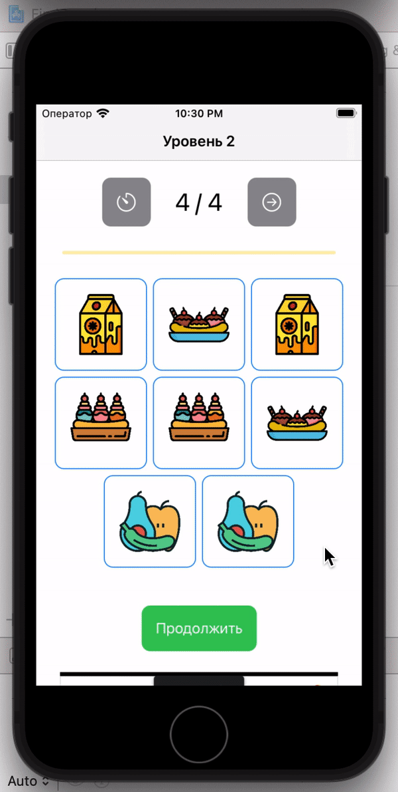

## FindCouple

### About

A small game as a technical task for work from [Arbita](https://arbita.agency) company. 

<b>Date:</b> 13/08/2021

<b>Project Title:</b> Find Couple

<b>Project Task:</b> We need to implement a working "tiles", "find pair" theme application where the user will search for pairs for images.

### Description

First, I created a couple of levels for the game and started making them more difficult. I added time per round, increased the number of pictures per round, increased the closing speed of open pictures. 

Next I tackled the store, it was also in the task, connected `StoreKit`, configured and added 3 items on the local file to test `In-App Purchases`. 

Another task was to add an ad unit in the game, which I did with `GoogleMobileAds`

At the end of their tasks, I implemented a screen swap that users who came to the application from a certain country did not get to the game, but to a third-party site. To do this, I made a `GET` request first to get the user's `IP` and then another one to get his geolocation. And as a result I opened the site using `WebKit`

